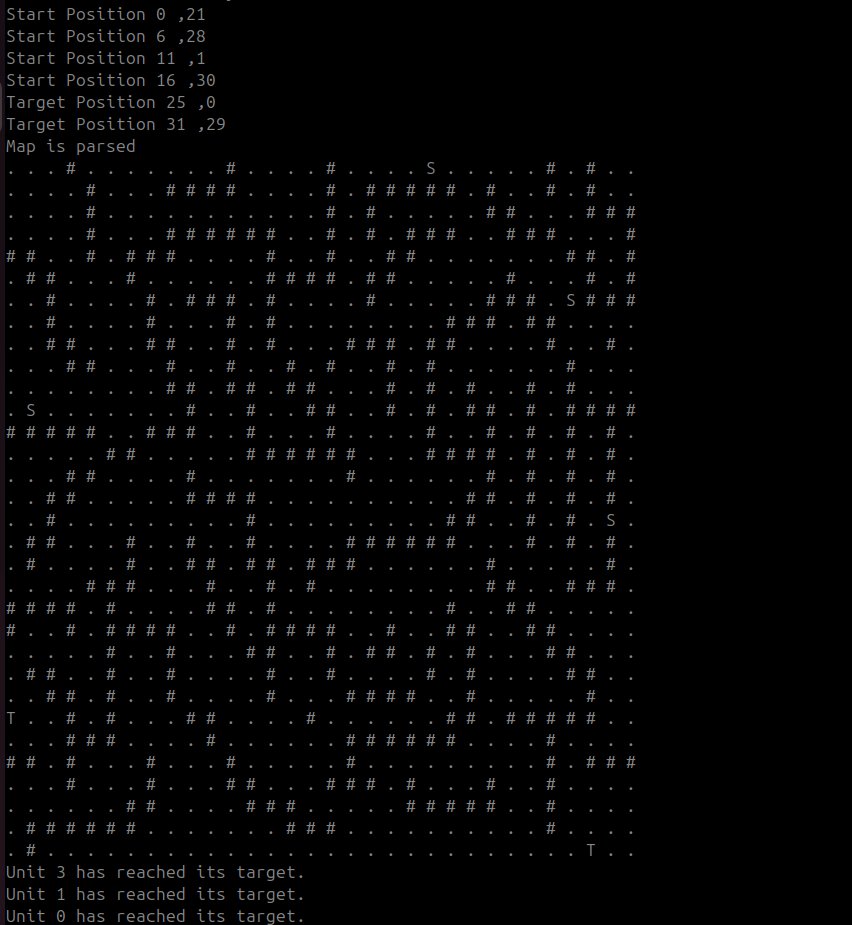
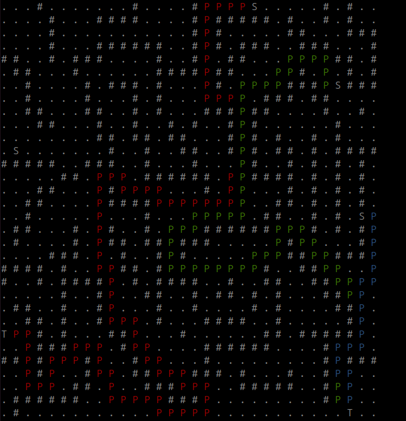

# Real Time Simultaneous PathFinder

## Class Description
The `PathFinder` class is designed to plan paths for multiple units from their respective start positions to their target positions on a grid-based map. It uses the A* search algorithm to find optimal paths for each unit while avoiding collisions. The solution aims to simulate real-time movement, where all units make a move sequentially in each iteration until they reach their targets.

## Coding Conventions
- **Public APIs** are written in **capitalized camel case** (e.g., `FindPaths`).
- **Private APIs** use **camel case** (e.g., `parseConfig`).
- **Member variables** start with the prefix `m_` (e.g., `m_mapFilePath`).
- **Constants File for Reusability** A separate **constants file** (`PathFinderConstants.hpp`) is used to define reusable strings to prevent spelling errors and assist reusability. These constants are organized into a namespace to promote maintainability and prevent conflicting declarations when used within a larger system with other constant declarations.

## Map File
The map file used by the `PathFinder` is parsed as integers when reading ignoring any decimals. This allows for uniform comparison against defined terrain types.The map file itself is sourced from a [sample battlefield from the RiskyLab tilemap](https://gist.github.com/dgehriger/80817b039498ed60657da048f980233f), which is structured for compatibility with the `PathFinder`. The program expects this same structure for correct execution. The [RiskyLab Tilemap tool](https://riskylab.com/tilemap/#) can be used to create different maps and terrains.

## Config File
The **config JSON file** dictates the values of the different types of terrain, namely **start**, **target**, **reachable**, and **elevated**. This configuration makes it easier to adapt the program to different maps without the need to recompile the code for each variation. The path for the map file is also specified in this config file.

## Exception Handling
Exceptions are thrown appropriately during map creation, including scenarios like **out-of-bounds errors**, **missing fields in the config or map data**, and other JSON parsing errors. This ensures robustness by handling various edge cases.

## JSON Parsing
The **nlohmann JSON** library, a third-party library, is used for reading and writing JSON files. This makes JSON operations simple and efficient within the C++ code, minimizing custom parsing logic. The repository can be found here [Nlohmann JSON GitHub Repository](https://github.com/nlohmann/json)

## Map Representation
A **vector of vector of integers** (`std::vector<std::vector<int>>`) is used for representing the map. This representation is chosen because:
1. **Indexing**: Indexing of vectors is simplified creating code that is easier to understand
2. **Optimized Access**: Vectors provide O(1) access time, allowing for efficient checks and modifications, improving the performance of the pathfinding algorithm.

## Public API
The class provides the following **public APIs** for interaction with other modules:
- **`FindPaths`**: This is the primary method that calculates paths for all units from their starting points to their targets.
- **`GetTargetPosition`**: Retrieves the target position of a unit provided by the index.
- **`GetStartPosition`**: Retrieves the target position of a unit provided by the index.
- **`GetMap`**: Returns the map representation.

Once the configuration and map files are set up, the application only needs to call `FindPaths` to initiate the pathfinding process.

## Pathfinding Algorithm
The **A* algorithm** is used to find the optimal path between the start and target points. The algorithm uses the **Manhattan distance** as a heuristic, which works well for grid-based searches where movement is restricted to **up, down, left, and right**. A* was chosen because it guarantees finding the shortest path if one exists, and is well-suited for grid-based environments with obstacles that have predictable movement patterns.

### Multiple Units Pathfinding
The solution has been expanded to accommodate multiple units, each with its own start and target positions. During each iteration, all units move **simultaneously** by taking one step, while checking for collisions. Each unit plans its movement in coordination with others to avoid occupying the same space by eliminating occupied spaces from the viable moves list.

Once all units reach their respective targets, the **`FindPaths`** function prints the map, highlighting the paths taken by each unit. The paths cycle through six colors for visualization, repeating if more than six units are present.

The function **does not throw exceptions** if a unit's path cannot be found. Instead, it continues planning for other units that may still find a path.

## Installation Instructions
To install the required libraries and build the project, follow these steps:

```sh
sudo apt-get install nlohmann-json3-dev
sudo apt-get install libgtest-dev
sudo apt-get install cmake
mkdir build
cd build
cmake ..
make
```

- **Run Unit Tests**: `./runTests` to run the unit tests.
- **Run Path Finder**: `./RTSPathFinder` to run the pathfinder application.

## Sample Run
In the sample run, there are **4 units**, each with a specified starting position. Only **2 target positions** are defined, demonstrating the handling of **target duplication**. One unit is isolated by elevated terrain, making it impossible to find a path to the target, while the other three units successfully reach their targets. This can be visualized in the generated output.
Parsed Map:


Map with solved paths:


## Assumptions
- The data structure of generated tilemaps is similar to the example and follows certain criteria such as `layers[0][data]` containing the data of the map and `[tilesets][0][tilewidth]` & `[tilesets][0][tilewidth]` contain the size of the map and determine the expected number of elements
- Data in the map file is processed as integers, converting any **decimals to integers** for terrain checks.
- If the number of target positions is **less than the number of starting positions**, the last target is duplicated for additional units.
- The first start position is currently assigned to the first found target position, and so on, based on the order in which the map is parsed. To specify exact targets for each unit independently, the code will need to be modified to allow explicit assignment of target positions to specific units.
- Developed and tested on a **Linux** machine; cross-compilation for Windows was not performed, and modifications to the CMake setup may be required.

## Testing
The testing suite uses **Google Test (gtest)** and includes the following features:
- **Setup and Teardown**: The `SetUp()` and `TearDown()` functions in `gtest` ensure that all data files required by the tests are generated on-the-fly and deleted afterward to maintain a clean test environment.
- **Test Cases**: There are **8 test cases** that verify different aspects of the implementation, such as:
  - **Constructor**: Tests basic instantiation.
  - **Map Creation**: Tests for a single start and target, multiple starts and targets, multiple start but insufficient targets, and maps with decimal values.
  - **FindPaths**: Tests pathfinding in various conditions like **no obstacles** and **only obstacles**.
  - **Custom Config File**: Tests map parsing with a custom configuration, demonstrating flexibility in defining map values.

These tests ensure that the `PathFinder` class is robust and capable of handling a variety of input configurations and map scenarios.

## Improvements and Optimizations

- **Priority Queue Replacement**: The current implementation uses a standard priority queue (`std::priority_queue`). Switching to a custom priority queue or a min-heap with better support for update operations could improve performance, especially when dealing with a large number of nodes.
- **Use of Smart Pointers**: Currently, raw pointers are used to track parent nodes in the pathfinding algorithm. Converting these to **smart pointers** (`std::shared_ptr` or `std::unique_ptr`) can help manage memory more safely, preventing memory leaks and simplifying cleanup. Smart pointers automatically release memory when no longer needed, leading to safer memory management.
- **Parallel Pathfinding**: The current solution calculates the path for each unit sequentially. Leveraging **parallel processing** techniques, such as using **std::async**, could enable simultaneous pathfinding for multiple units, significantly reducing the total computation time.
- **Dijkstra's Algorithm for Dense Maps**: In cases where the map is very dense with obstacles, **Dijkstra's algorithm** may outperform A* because it does not rely on a heuristic and instead explores nodes based solely on cost. Implementing a switch between A* and Dijkstra's algorithm based on map characteristics could improve overall efficiency.
- **Dynamic Weight Adjustment**: Modifying the A* heuristic dynamically based on the distance to other units could help in reducing congestion and improve coordination among units, especially in tightly packed environments.
